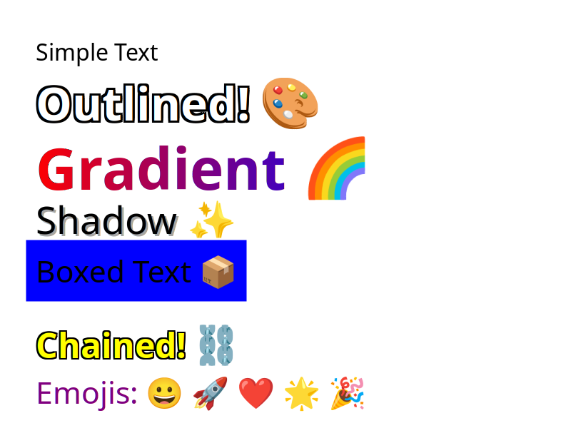

<div align="center">

# 🎨 PyEmoji2

**Add beautiful text and emojis to images with zero dependencies** 🚀✨

[](https://pypi.org/project/pyemoji2/)
[](https://pypi.org/project/pyemoji2/)
[](https://github.com/GrandpaEJ/pyemoji2/blob/main/LICENSE)
[](https://pepy.tech/project/pyemoji2)

[](https://github.com/GrandpaEJ/pyemoji2/actions/workflows/build.yml)
[](https://github.com/GrandpaEJ/pyemoji2/actions/workflows/publish.yml)

*A high-performance Python library for rendering text and emojis onto images. Built with **Cairo** and **Pango**, bundled for absolute simplicity.*

[📖 Documentation](docs/README.md) • [📚 Examples](examples/) • [🚀 Quick Start](#-quick-start) • [📦 Installation](#-installation)

---

## ✨ Features

<div align="center">

| 🚀 **Performance** | 🎨 **Features** | 🌍 **Compatibility** |
|:---:|:---:|:---:|
| ⚡ **Native Speed** - C extension | 🎯 **Zero Dependencies** - Bundled | 🐧 **Linux** x86_64/i686 |
| 🔥 **Lightweight** - 5-8MB wheels | 🎨 **Rich Text** - All fonts & emojis | 🍎 **macOS** x86_64 |
| 📈 **Memory Efficient** - Direct access | 🖼️ **Image Formats** - PNG output | 🪟 **Windows** 🚧 Planned |
| 🔄 **Cross-Platform** - Universal | 📱 **Mobile Ready** - Android/Termux | 🤖 **Android** Build support |

</div>

> **🎯 Zero System Dependencies** - Everything bundled in the wheel, works everywhere!

## 📦 Installation

### 🚀 Quick Install (Recommended)

```bash
pip install pyemoji2
```

<div align="center">
  
</div>

**✨ Zero system dependencies, works everywhere!**

### 🛠️ Development Installation

For contributors and advanced users:

```bash
# Clone the repository
git clone https://github.com/GrandpaEJ/pyemoji2.git
cd pyemoji2

# Install in development mode
pip install -e .
```

#### System Dependencies (Only for development)

| Platform | Command |
|----------|---------|
| **Ubuntu/Debian** | `sudo apt install libcairo2-dev libpango1.0-dev pkg-config` |
| **macOS** | `brew install cairo pango pkg-config` |
| **Windows (MSYS2)** | `pacman -S mingw-w64-x86_64-cairo mingw-w64-x86_64-pango` |
| **Termux (Android)** | `pkg install libcairo pango pkg-config` |

## 🌍 Platform Support

<div align="center">

### ✅ **Pre-built Wheels Available**
| Platform | Architectures | Status |
|----------|---------------|--------|
| 🐧 **Linux** | x86_64, i686 | ✅ Full Support |
| 🍎 **macOS** | x86_64 | ✅ Full Support |
| 🪟 **Windows** | x86_64 | 🚧 Planned |

### 🔧 **Build from Source**
- 🤖 **Android/Termux** - Full support
- 🖥️ **Linux ARM64** - Build from source
- 📱 **iOS** - Build from source

</div>

## 📖 Documentation

For comprehensive API documentation and examples, see [`docs/README.md`](docs/README.md).

## 🚀 Quick Start

### 🎯 Basic Usage

```python
from pyemoji2 import Image

# Load an image and add text
img = Image.load("photo.jpg")
img.add_text("Hello World! 🌍", 50, 100, font_size=40, color="white")
img.save("output.png")
```

<div align="center">
  
  <p><em>Simple text addition with emoji support</em></p>
</div>

### 🎨 Advanced Styling

```python
from pyemoji2 import Image, Text, TextBox

# Create a beautiful image
img = Image.create_empty(800, 600)

# Add styled title
title = Text("🎉 PyEmoji2", size=72)
title = title.with_color("gold").with_outline("black", 3)
img.add(title, (50, 80))

# Add subtitle
img.add_text("Beautiful text on images", 50, 180, font_size=36, color="white")

# Add feature box
box = TextBox("✨ Zero Dependencies ✨", size=32)
box = box.with_background("rgba(0,0,0,0.7)", 15).with_border("gold", 3)
img.add(box, (50, 280))

# Add gradient text
gradient = Text("🌈 Gradient Magic", size=48)
gradient = gradient.with_gradient("red", "blue")
img.add(gradient, (50, 400))

img.save("beautiful.png")
```

<div align="center">
  
  <p><em>Advanced text styling with gradients, outlines, and backgrounds</em></p>
</div>

### 🔄 Interoperability

```python
from pyemoji2 import Image
from PIL import Image as PILImage

# Convert from PIL
pil_image = PILImage.open("input.jpg")
img = Image.from_pil(pil_image)

# Add emoji overlay
img.add_text("📸 Edited with PyEmoji2", 20, 20, font_size=24, color="white")
img.save("edited.jpg")

# Works with any image library!
```

### 📱 Context Manager (Memory Safe)

```python
from pyemoji2 import Image

# Automatic resource cleanup
with Image.create_empty(400, 300) as img:
    img.add_text("Memory safe! 🛡️", 50, 150, font_size=30)
    img.save("safe.png")
# Resources automatically cleaned up
```

## 📚 API Reference

### 🎨 Image Class

The main class for image manipulation with emoji support.

#### Class Methods

| Method | Description |
|--------|-------------|
| `Image.load(path)` | Load image from file path |
| `Image.open(path)` | Alias for `load()` |
| `Image.create_empty(width, height)` | Create blank ARGB32 image |
| `Image.from_pil(pil_image)` | Convert from PIL/Pillow Image |
| `Image.from_imgrs(imgrs_image)` | Convert from imgrs Image |

#### Instance Methods

| Method | Description |
|--------|-------------|
| `add(text_obj, position)` | Add Text or TextBox object at position |
| `add_text(text, x, y, ...)` | Add simple text with styling options |
| `save(output_path)` | Save image as PNG |
| `close()` | Explicitly close and cleanup resources |

#### Context Manager Support

```python
with Image.create_empty(400, 300) as img:
    img.add_text("Safe!", 50, 150)
    img.save("output.png")
# Automatic cleanup
```

### ✍️ Text Class

Advanced text styling with method chaining.

```python
from pyemoji2 import Text

# Create and style text
text = (Text("Hello World! 🌍", size=48)
        .with_color("gold")
        .with_outline("black", 2)
        .with_shadow(3, 3, "gray", 0.7))
```

#### Constructor
```python
Text(text, font="DejaVu Sans", size=24)
```

#### Styling Methods

| Method | Description | Example |
|--------|-------------|---------|
| `with_color(color)` | Set text color | `"red"`, `"#FF0000"`, `"white"` |
| `with_outline(color, width)` | Add text outline | `with_outline("black", 3)` |
| `with_gradient(c1, c2, vertical)` | Add color gradient | `with_gradient("red", "blue")` |
| `with_shadow(dx, dy, color, opacity)` | Add drop shadow | `with_shadow(2, 2, "gray", 0.5)` |

### 📦 TextBox Class

Text with background and border support.

```python
from pyemoji2 import TextBox

box = (TextBox("Important Message", size=32)
       .with_background("lightblue", 15)
       .with_border("blue", 3)
       .with_color("darkblue"))
```

#### Additional Methods

| Method | Description |
|--------|-------------|
| `with_background(color, padding)` | Set background color and padding |
| `with_border(color, width)` | Set border color and width |

### 🎨 Supported Colors

- **Named colors**: `"red"`, `"blue"`, `"black"`, `"white"`, `"gold"`, etc.
- **Hex colors**: `"#FF0000"`, `"#00FF00"`, `"#0000FF"`
- **RGBA**: `"rgba(255,0,0,0.8)"` (experimental)

### 🔤 Font Support

- **Default**: `"DejaVu Sans"` (excellent Unicode/emoji support)
- **System fonts**: Any installed font family name
- **Automatic fallback**: Platform-specific font selection

## 🖼️ Examples Gallery

<div align="center">

### Basic Text Addition


### Advanced Styling


### Emoji Support


*See [`examples/`](examples/) directory for all examples and source code*

</div>

## 📊 Performance

<div align="center">

| Metric | Value | Notes |
|--------|-------|-------|
| **Rendering Speed** | ~1ms | Typical text rendering |
| **Memory Usage** | Minimal | Direct Cairo surfaces |
| **Wheel Size** | 5-8MB | All dependencies bundled |
| **Startup Time** | Instant | No loading delays |
| **Cross-platform** | Native | Optimized for each platform |

</div>

## 🛠️ Development

### 🚀 Quick Setup

```bash
# Clone and setup
git clone https://github.com/GrandpaEJ/pyemoji2.git
cd pyemoji2
pip install -e .[dev]

# Run examples
cd examples
python basic_usage.py
```

### 🏗️ Build from Source

```bash
# Build C extension
python setup.py build_ext --inplace

# Or use local cross-build script
python build_local.py --test
```

### 🧪 Testing

```bash
# Run examples
cd examples && python basic_usage.py

# Run with different libraries
pip install pillow imgrs
python examples/api_demo.py
```

### 📖 Documentation

- **[API Reference](docs/README.md)** - Complete API documentation
- **[Build Guide](BUILD_README.md)** - Cross-platform build instructions
- **[Examples](examples/)** - Working code samples

## 🤝 Contributing

<div align="center">

### Ways to Contribute
- 🐛 **Bug Reports** - Open an issue
- ✨ **Feature Requests** - Suggest improvements
- 🛠️ **Code** - Submit pull requests
- 📖 **Documentation** - Improve docs and examples

### Development Workflow
1. Fork the repository
2. Create a feature branch
3. Make your changes
4. Run tests: `python build_local.py --test`
5. Submit a pull request

</div>

## 📄 License

<div align="center">

**Apache License 2.0** - Free for personal and commercial use

[](LICENSE)

</div>

## 🙏 Acknowledgments

<div align="center">

**Built with ❤️ using:**

[](https://cairographics.org/)
[](https://pango.gnome.org/)
[](https://cibuildwheel.readthedocs.io/)

**Special thanks to:**
- Cairo Graphics community
- Pango development team
- cibuildwheel maintainers
- All contributors and users!

</div>

---

<div align="center">

### 🎉 **Ready to add beautiful text to your images?**

```bash
pip install pyemoji2
```

**Zero dependencies • Cross-platform • Lightning fast** ⚡

[📖 Full Documentation](docs/README.md) • [📚 Examples](examples/) • [🐛 Report Issues](https://github.com/GrandpaEJ/pyemoji2/issues)

---

*Made with ❤️ for the Python community*

</div>